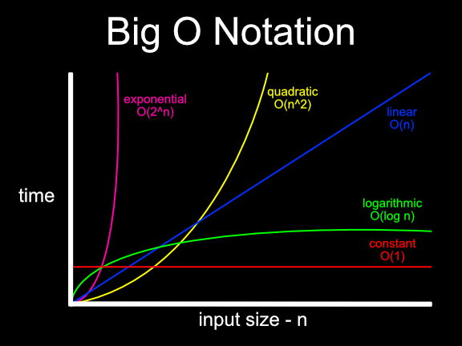

# Data structure and Algorithm Learning

- Constant time - effectively means that an algorithm’s time complexity isn’t affected by the input size. Sometimes referred to as bounded time.
- Exponential time - these algorithms are costly. Exponential times increase dramatically in relation to the size of the input.
- Factorial time - these algorithms are even more costly then exponential algorithms.
- Linear time - this means the amount of work depends on the size of the input. Less efficient the bigger the input.
- Logarithmic time - narrows search by repeatedly halving the input until target value is found.
- N log2N - time involves applying a logarithmic algorithm N times.
- Quadratic time - algorithms of this type typically involve applying a linear algorithm N times.

